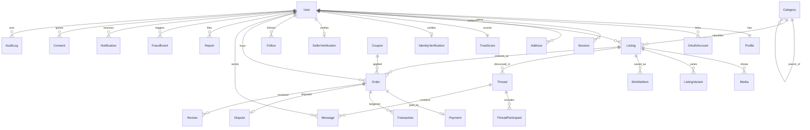

# 05 — Database Schema (ERD)

The authoritative ERD is the Prisma schema: [`prisma/schema.prisma`](../prisma/schema.prisma). This document explains the model, the key decisions, and the diagram.

## Design principles
- **PostgreSQL 16** single primary. One datastore for MVP (also powers search via FTS).
- **Money = integers in minor units (paise)** + `currency`. Never floats. All amounts suffixed `Minor`.
- **Category-agnostic by data:** `Category.attributeSchema` (JSON) defines per-category fields; `Listing.attributes` (JSONB) stores values. New vertical = new row, no code.
- **JSONB for flexible/rarely-filtered data** (attributes, timelines, evidence, factors); **real columns for anything you filter/sort** (status, price, category, timestamps) so indexes work.
- **Soft-delete** (`deletedAt`) where users can recover/where we need history; **cascade** only for tightly-owned children (media, thread reads, participants).
- **Immutable ledgers**: `Transaction` (money) and `AuditLog` (actions, hash-chained) are append-only.
- **Denormalized reputation counters** on `Profile` (ratingAvg, completedSales, followerCount, responseMins) kept fresh by BullMQ workers — reads stay O(1).

## Entity map (grouped)

| Domain | Entities |
|---|---|
| Identity & Auth | `User`, `Profile`, `OAuthAccount`, `Session` |
| Catalog | `Category`, `Listing`, `ListingVariant`, `Media` |
| Commerce | `Address`, `Order`, `Payment`, `Transaction`, `Coupon` |
| Messaging | `Thread`, `ThreadParticipant`, `Message` (incl. structured `OFFER`) |
| Social/Reputation | `Review`, `WishlistItem`, `Follow`, `Notification`, `TrustScore` |
| Trust & Safety | `Report`, `ModerationAction`, `FraudEvent`, `Dispute` |
| Verification | `IdentityVerification`, `SellerVerification` |
| Ops/Compliance | `SupportTicket`, `Consent`, `AuditLog`, `FeatureFlag` |

## ER diagram (core)



## Notable relationships & rules
- **Dual role:** a single `User` is both buyer and seller (`ordersAsBuyer` / `ordersAsSeller`); no separate account types.
- **Order state machine** is enforced in the service layer; every transition appends to `Order.timeline` (actor + status + ts). Allowed edges: `PENDING→ACCEPTED|REJECTED|CANCELLED`, `ACCEPTED→PACKED|CANCELLED`, `PACKED→SHIPPED`, `SHIPPED→DELIVERED`, `DELIVERED→RETURNED`, `RETURNED→REFUNDED`.
- **Payments** are webhook-driven and **idempotent** (`idempotencyKey` unique + provider IDs). A `Payment` maps 1:1 to an `Order`; money movements are recorded as `Transaction` rows.
- **Reviews** are unique per `(orderId, authorId)` → one review per side per order, `verified` = came from a real order.
- **Offers** are `Message` rows with `kind=OFFER` + `offerMinor` + `offerStatus`, so negotiation lives in the auditable chat history (dispute evidence).
- **Trust** is explainable: `TrustScore.factors` and `FraudEvent.evidence` store the breakdown so admins see *why*.

## Indexing strategy (starter)
- Listings: `(status, publishedAt)`, `(categoryId, status)`, `(sellerId, status)` for feed/browse/seller pages.
- Full-text: a generated `tsvector` column over `title + description + tags` with a GIN index; `pg_trgm` GIN for autocomplete/fuzzy. (Added in migration, not expressible in vanilla Prisma DSL — see below.)
- Orders: `(buyerId, status)`, `(sellerId, status)` for dashboards.
- Messages: `(threadId, createdAt)` for pagination.
- Fraud: `(status, riskScore)` to drive the prioritized queue.

## Search (v1, Postgres) — migration snippet
Prisma can't express generated tsvector columns directly, so add via raw SQL migration:

```sql
ALTER TABLE listings ADD COLUMN search_vector tsvector
  GENERATED ALWAYS AS (
    setweight(to_tsvector('simple', coalesce(title,'')), 'A') ||
    setweight(to_tsvector('simple', coalesce(description,'')), 'B') ||
    setweight(to_tsvector('simple', array_to_string(tags,' ')), 'C')
  ) STORED;
CREATE INDEX listings_search_idx ON listings USING GIN (search_vector);
CREATE INDEX listings_title_trgm ON listings USING GIN (title gin_trgm_ops);
```
Query with `search_vector @@ websearch_to_tsquery('simple', :q)` and `ORDER BY ts_rank(...)`. Migrate to OpenSearch when result relevance/scale demands it ([17](17-scaling-roadmap.md)).

## Data protection notes (see [11](11-security-architecture.md))
- **Never** store raw KYC docs or card data. `IdentityVerification.providerRef` points to an encrypted vault / provider token; card data stays with the PCI-compliant gateway.
- `mfaSecret` and any secrets are encrypted at rest (app-level envelope encryption + KMS).
- `Session` stores only a **hash** of the refresh token; raw tokens live only in the client cookie.
- PII columns (email as `citext`, phone) are minimized, access-logged, and covered by DSAR export/delete.

## Migrations & seeding
- Prisma Migrate for schema; a `seed` script inserts the **category tree + attribute schemas** and default `FeatureFlag`s so the platform is category-populated on first boot.
