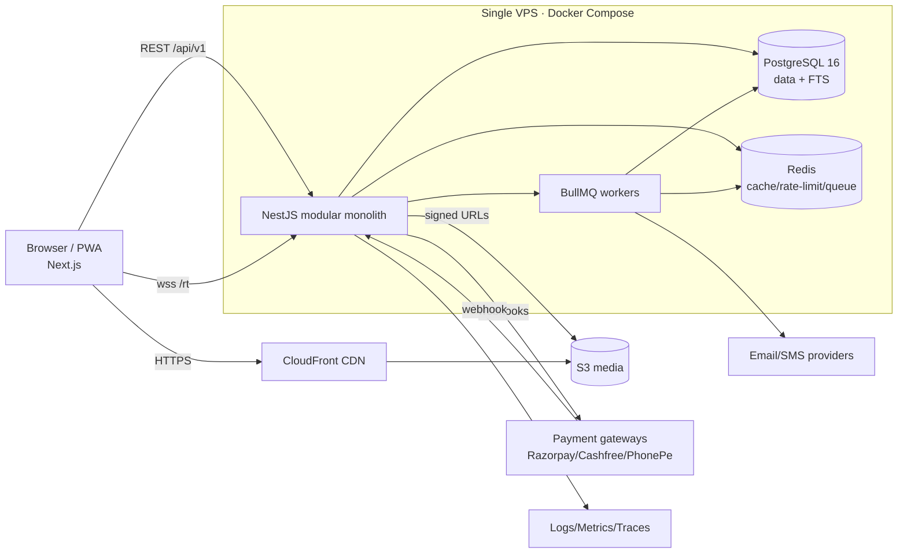
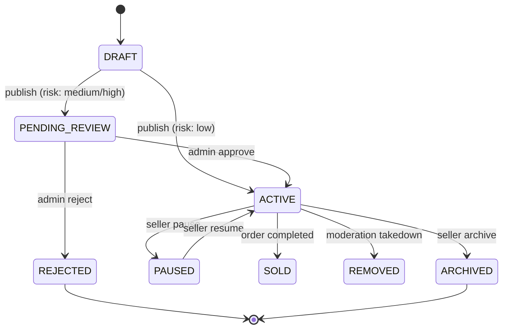
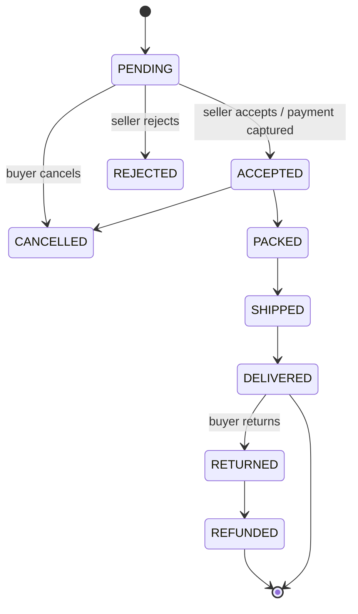
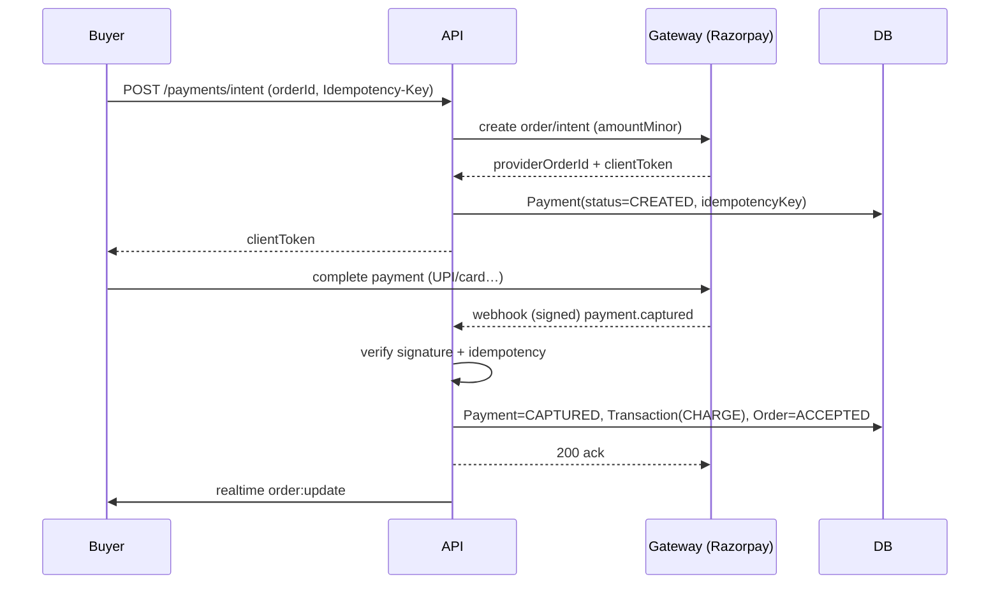
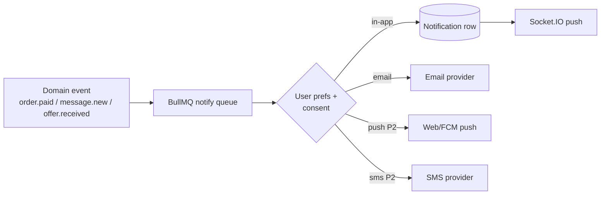
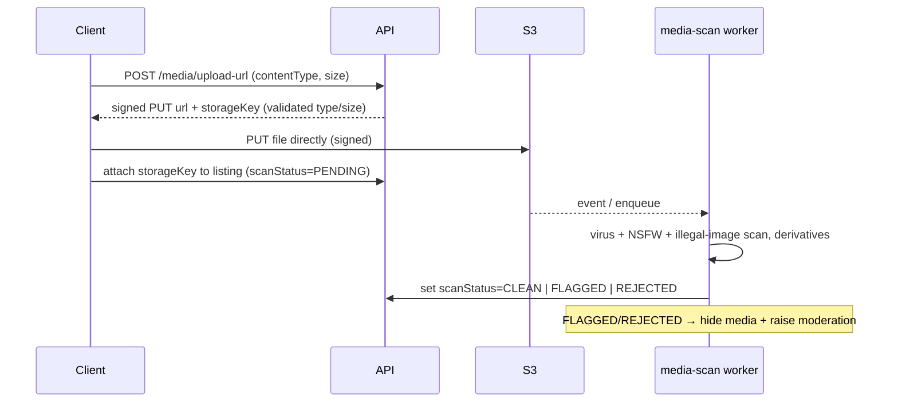
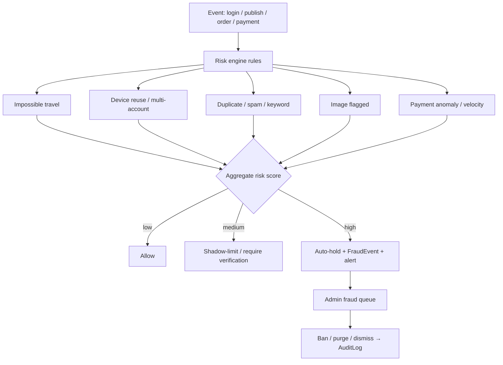
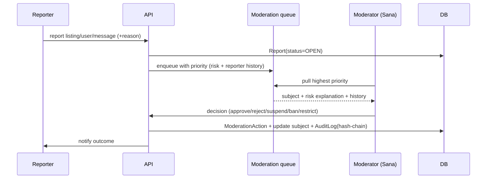

# 09 — System Design Diagrams

All diagrams are Mermaid (render on GitHub). They cover the flows requested: high-level architecture, auth, listing lifecycle, purchase, payment, notification, chat, media upload, fraud detection, moderation.

## 1. High-level architecture


## 2. Authentication flow (login + refresh rotation)
```mermaid
sequenceDiagram
  participant C as Client
  participant API as Auth module
  participant DB as Postgres
  participant R as Risk engine
  C->>API: POST /auth/login (email, pwd)
  API->>DB: verify Argon2id hash
  API->>R: score login (ip, device, geo)
  R-->>API: risk verdict
  alt MFA enabled or high risk
    API-->>C: 200 { mfaRequired:true }
    C->>API: POST /auth/login (mfaCode)
  end
  API->>DB: create Session (hash of refresh)
  API-->>C: access JWT (15m) + refresh cookie (httpOnly)
  Note over C,API: later…
  C->>API: POST /auth/refresh (cookie)
  API->>DB: lookup+rotate; reuse? revoke family
  API-->>C: new access JWT + new refresh cookie
```

## 3. Listing lifecycle


## 4. Purchase lifecycle (order state machine)


## 5. Payment flow (webhook-driven, idempotent)


## 6. Notification flow


## 7. Chat architecture
```mermaid
flowchart LR
  subgraph Clients
    A[Buyer] ; B[Seller]
  end
  A <-->|wss /rt JWT| GW[Socket.IO gateway]
  B <-->|wss /rt JWT| GW
  GW <--> RADP[(Redis adapter<br/>multi-instance fanout)]
  GW --> SVC[Messaging service]
  SVC --> DB[(messages / threads)]
  SVC --> MQ[risk queue: moderate media/text]
  SVC --> NQ[notify queue: offline recipients]
  Note over GW,SVC: REST is source of truth;<br/>sockets deliver typing/read/presence/offers
```

## 8. Media upload flow (direct-to-S3 + async scan)


## 9. Fraud detection flow


## 10. Moderation workflow

